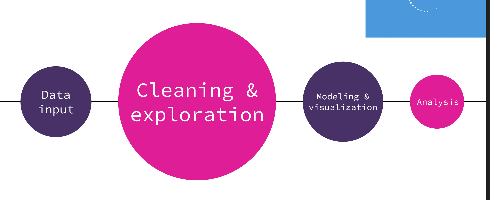

# Predicting 2015 Flight Delays 

## Overview

Every year, airline flights get delayed, costing travelers time and money. Many factors affect flight delays, including air traffic control backups, equipment delays, and weather. Our goal was to leverage the massive amount of data available on flight punctuality and weather to forecast whether a flight would be delayed. The project is based on the 2015 Flight Delay and Cancellation dataset from Kaggle ([click here to download](https://www.kaggle.com/usdot/flight-delays)). Unfortunately, due to time constraints and lack of hourly data for 2015, the weather data fetched using NOAA API was not used.

### Scope

First a dataset was selected, cognizant of its usability, with enough features and significant data size. Then came the cleaning portion and data exploration. Followed by the modeling and visualization to show the results of the model. Finally, conclude which models were the best at predicting the delay.

An Exploratory Data Analysis was performed. The results of which fed into the feature selection process and then the feature encoding process.
Supervised and Deep learning models were used to predict the delay. Selecting the specific features we would use in our data set involved plotting graphs of all the feautures we have in the data set and seeing how they affect the arrival delay. With this visualization we were able to drop the columns with features that we didn't think were ncessary to our project. This left us with a much more cleaner and more specific data set to work with.

A two-fold approach was taken. The first was to predict the delay as 'short delay,' 'medium delay,' and 'long delay' (Classification). The other was to predict the delay itself (Regression).

## Data
The dataset contains 5M rows of flights., 14 airlines, and 322 airports. The flight's CSV had some airports with four-digit codes instead of IATA codes. We were able to fix the problem using a [tutorial](https://www.kaggle.com/srcole/fix-inconsistent-airport-codes) from kaggle. Weather data  was fetched but the the airport data did not have the address or zip-code to fetch the data from [NOAA](Homepage | National Oceanic and Atmospheric Administration (noaa.gov). To fix this, the airportndata was updated with zip codes using Geocoders API and Google API, as Geocoders API was not able to get zip codes by just the airport name and state, while google API returned multiple addresses for the airport.  The data was then cleaned and finally the data encoded.

## Explotaory Data Analysis
This step included plotting graphs for all the data. A graphical visualization gaves a clear perspective on which features really affected the flight arrival delay and those are the features that were used to build various prediction models. 

## Preprocessing
The original data set uses two codes for each airport. October: 5-digits; other months: 3-letters. This notebook resaves the data so that all flights are encoded using the 3-letter system

## Cleaning & Encoding
-Remove all 'DIVERTED' and "CANCELLED' flights as they are not technically delayed.
-Remove columns that were irrevant.
-The time (HHMM) colums were categorized as Morning, Afternoon, Evening and red light.
-Binary encoding of airline.
-Hashing endoing on both departure and arrival airports.

### Multi-Class Classification

The Models used for predicting delays were as follows:

1. Random Forest
2. Decision Tree
3. K Nearest Neighbor
4. Gradient Boosting
5. Stochastic Gradient Descent 
6. Shallow NN & Deep NN (2 layers)
7. RecurrectLSTM

### Conclusion:

The 2-layer Neural network outperformed all the supervised learning Models. The worst was the kNN, which returned terrible results.
Nadam optimizer seems to be the best balanced between loss and over-fitting.
Hot encoding significantly improved the 'accuracy' of the model but turned it into a multi-class target classification.

### Postmoterm

## Difficulties:
1. Huge data set that was difficult to load to the machine and run it.
2. Some models took upto two days to run hence time consuming.
3. Due to the size of the data set and time constraint we were unable to explore other softwares like PowerBi and AWS that could accomodat our dat with much more effeciency.

## Reflections:
In future, if presented with a huge data set, it's always good to sample the data and run models based on the sampled data then keep adding more data as you improve the models. This saves so much time.

Overall, our models gave us the desired predictions. It is also good to note that these models are not ready to use in the industry yet as they need more improvement however, they give a very good guidline and starting point. This project was a great learning curve.

## Note
Due to the huge data set that we had, were unable to upload our files to github however, our work can be found in google drive by clicking the [link](https://drive.google.com/drive/folders/131ZFUUMJAZOHefZRv5gBb5GZYlKQ2JmX?usp=sharing)
The files are all labelled with our individual names. In order to get a good understanding and a clear flow of the data and models please open the files in the order outlined:
        - Faith - Data Visualization
        - Sabahat - Variuos models with conclusions.
        - Allen - Varrious models with conclusions.
        
Also provided in the various notebooks are readme files that give a prerequisite and flow of how to run the codes used.

